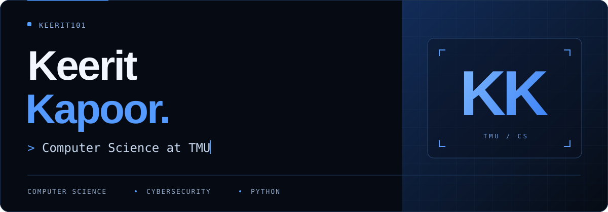
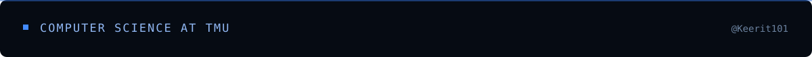

  

I’m **Keerit**, a **Computer Science student at Toronto Metropolitan University**. I’m interested in cybersecurity and Python, with projects covering secure coding, web assessments, API risk analysis, and phishing awareness.

  <a href="https://github.com/Keerit101?tab=repositories">Explore my repositories ↗</a>

## Selected work

### 01 &nbsp; / &nbsp; Secure coding, in practice

**[Python Secure Coding Review ↗](https://github.com/Keerit101/CodeAlpha_SecureCodingReview)**

An intentionally insecure demo, a hardened rewrite, and the reasoning behind each fix. Covers password handling, unsafe deserialization, and subprocess execution, with Bandit scans supporting the manual review.

PYTHON &nbsp; · &nbsp; BANDIT &nbsp; · &nbsp; CODE REVIEW

---

### 02 &nbsp; / &nbsp; From observation to evidence

**[Web Vulnerability Assessment ↗](https://github.com/Keerit101/FUTURE_CS_01)**

A limited assessment of a security-training web application. Documents transport security, response headers, and technology disclosure, with evidence, risk ratings, and practical remediation guidance.

NMAP &nbsp; · &nbsp; OWASP ZAP &nbsp; · &nbsp; HTTP

---

### 03 &nbsp; / &nbsp; Looking closer at APIs

**[API Security Risk Analysis ↗](https://github.com/Keerit101/FUTURE_CS_03)**

A study of a public demo API: what its responses reveal, which controls matter in production, and where data minimisation helps. Educational risk scenarios are clearly separated from confirmed vulnerabilities.

API SECURITY &nbsp; · &nbsp; BROWSER DEVTOOLS &nbsp; · &nbsp; RISK ANALYSIS

 

## My working toolkit

**Code** &nbsp; Python · Git · GitHub  
**Inspect** &nbsp; Bandit · Nmap · OWASP ZAP · Browser DevTools  
**Communicate** &nbsp; Evidence-led reports · Remediation guidance · Security awareness

 

  
<b>More work: the human side of security</b>

   

  
<a href="https://github.com/Keerit101/CodeAlpha_PhishingAwareness"><b>Phishing Awareness Training ↗</b></a> A training module with simulated examples, prevention guidance, and a knowledge-check quiz.

  
<a href="https://github.com/Keerit101/FUTURE_CS_02"><b>Phishing Detection &amp; Awareness ↗</b></a> Comparing safe, suspicious, and phishing emails through sender checks, link analysis, and common warning signs.

 

  

